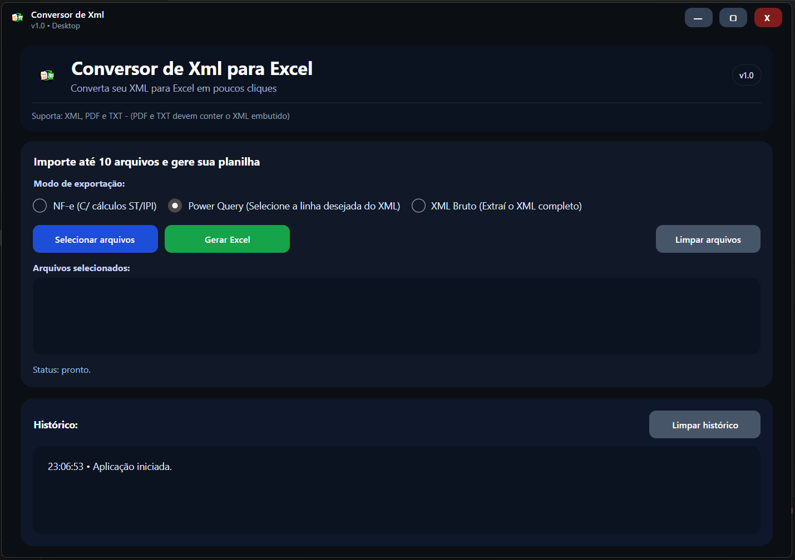
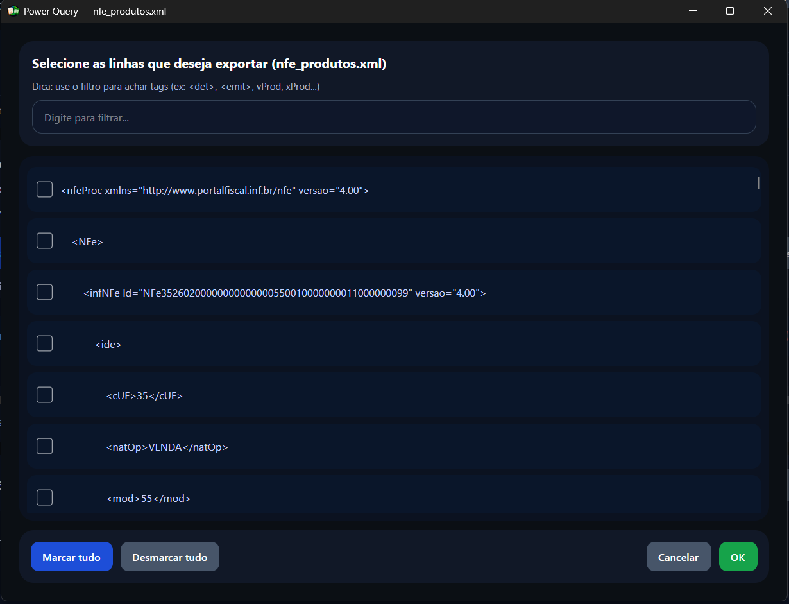

# Conversor de XML para Excel (NF-e / Power Query / XML Bruto)

> Aplicação desktop para **converter XML (e XML embutido em PDF/TXT)** em planilhas **Excel (.xlsx)** com poucos cliques.

---

## ⬇️ Download (Windows)

👉 Baixe o instalador na página de releases:  
**https://github.com/chrisbenini/Conversor-de-XML/releases/latest**

Arquivo: `ConversorXML_Setup_v1.0.exe` *(ou o mais recente disponível na release)*

---

## ✨ Principais recursos

✅ Importa **até 10 arquivos** de uma vez (XML / PDF / TXT)  
✅ **NF-e (com cálculos ST/IPI)** pronto para análise  
✅ **Power Query**: selecione as linhas/tags que quer exportar  
✅ **XML Bruto**: extrai o XML completo para Excel  
✅ Janela de **validação inteligente** (separa arquivos válidos e inválidos, com motivo)  
✅ Interface moderna (desktop) com histórico e status de execução

---

## 🧠 Modos de exportação

### 1) **NF-e (com cálculos ST/IPI)**
Ideal para extrair itens, impostos e totais de NF-e direto do XML.

### 2) **Power Query (seleção de linhas/tags)**
Você escolhe exatamente quais linhas/tags do XML deseja exportar (ex.: `<det>`, `<emit>`, `vProd`, etc.).

### 3) **XML Bruto**
Extrai o XML completo e organiza no Excel (bom para auditoria/consulta rápida).

---

## 🖼️ Screenshots

### Tela principal

### Janela de aviso (arquivos inválidos vs. gerados)

### Power Query (seleção de linhas)

> Se os nomes das imagens estiverem diferentes, ajuste os caminhos acima para bater com os arquivos do seu repo.

---

## 🚀 Como usar

1. Abra o app  
2. Clique em **Selecionar arquivos** e escolha XML/PDF/TXT  
3. Selecione o **modo de exportação**  
4. Clique em **Gerar Excel**  

> PDFs e TXTs precisam conter **XML embutido** (quando suportado).

---

## 🛠️ Tecnologias

- **C# / .NET 8**
- **Avalonia UI** (Desktop)
- **ClosedXML** (geração do `.xlsx`)
- **iText7** (extração de conteúdo/trechos de PDF)

---

## 🧩 Estrutura do projeto

App/Conversor.app/ # Código do app (Avalonia)
docs/screenshots/ # Prints para documentação (README)
installer/ # Arquivos do instalador (Inno Setup)

---

## 🗺️ Roadmap (próximas melhorias)

- [ ] Assinatura digital do instalador (Windows)
- [ ] Melhorias no preview/exportação do modo Power Query
- [ ] Exportação com template de colunas personalizáveis
- [ ] Logs detalhados e arquivo de diagnóstico automático

---

## 🤝 Contribuição

Sugestões e issues são bem-vindas:  
- Abra uma **Issue** descrevendo o problema/feature  
- Se quiser contribuir com código, envie um PR

---

## 📄 Licença

Este projeto está sob a licença **MIT**.  
Veja o arquivo [LICENSE](LICENSE) para mais detalhes.
