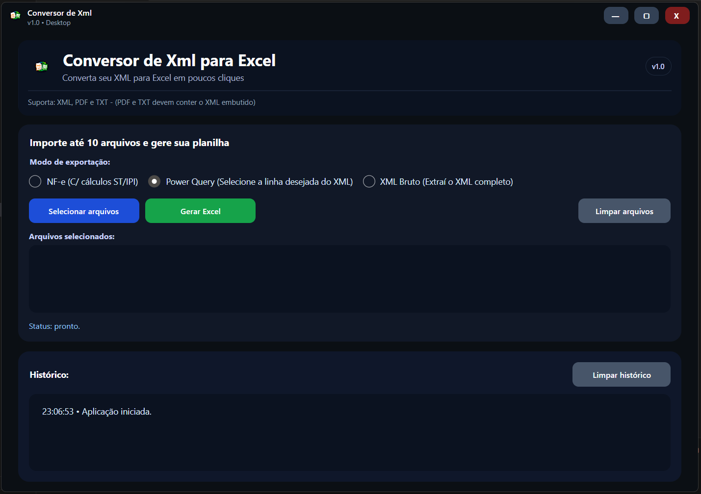
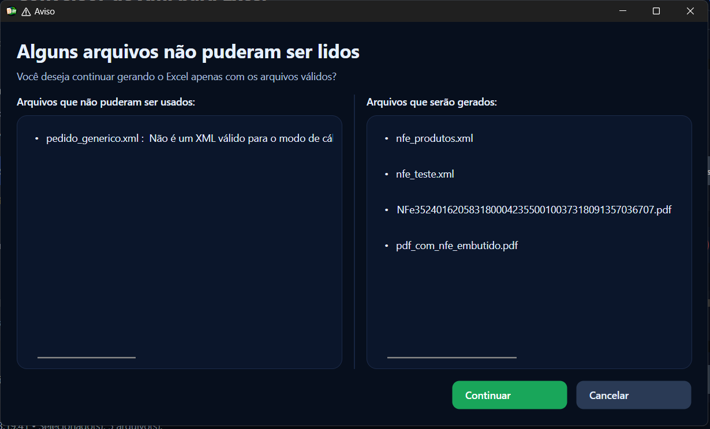
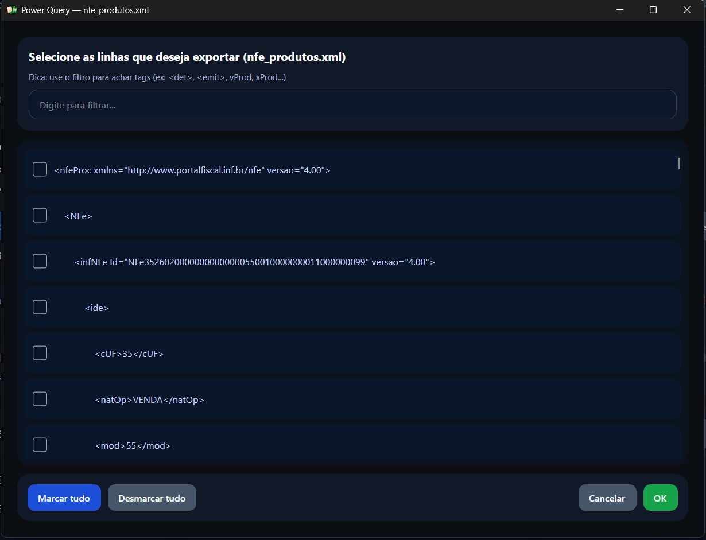

<p align="center">
  
</p>

<p align="center">
  
</p>

<p align="center">
  Aplicação desktop para <b>converter XML (.xml)</b> em planilhas <b>Excel (.xlsx)</b> com foco em <b>produtividade operacional</b>, <b>extração estruturada de dados</b> e <b>análise de documentos fiscais</b>.
</p>

<p align="center">
  <a href="https://github.com/chrisbenini/Conversor-de-XML/releases/latest">
    
  </a>
  <a href="https://github.com/chrisbenini/Conversor-de-XML/releases/latest">
    
  </a>
  <a href="https://github.com/chrisbenini/Conversor-de-XML/stargazers">
    
  </a>
  <a href="LICENSE">
    
  </a>
</p>

<p align="center">
  
  
  
  
</p>

---

## `> overview`

O **Conversor de XML para Excel** foi desenvolvido para transformar arquivos XML em planilhas estruturadas de forma rápida, prática e confiável.

A aplicação foi pensada para cenários em que é necessário:

- extrair informações fiscais de XMLs
- transformar dados em `.xlsx`
- acelerar análises operacionais
- reduzir trabalho manual
- validar arquivos antes da exportação

Além da conversão simples, o projeto oferece modos específicos para cenários diferentes de uso, incluindo leitura de **NF-e**, exportação orientada a **Power Query** e extração de **XML bruto**.

---

## `> download`

### Windows

Baixe o instalador na página de releases:

<p align="center">
  <a href="https://github.com/chrisbenini/Conversor-de-XML/releases/latest">
    
  </a>
</p>

**Arquivo esperado:** `ConversorXML_Setup_v1.0.exe`

---

## `> key_features`

- Importação de **até 10 arquivos por vez**
- Suporte para **XML / PDF / TXT**
- Conversão de **NF-e com cálculos de ST e IPI**
- Modo **Power Query** com seleção de linhas e tags
- Exportação de **XML bruto** para Excel
- Validação inteligente de arquivos
- Separação entre arquivos **válidos** e **inválidos**
- Interface desktop moderna com feedback visual de execução

---

## `> export_modes`

### `1. NF-e (com cálculos ST/IPI)`

Modo voltado para leitura de documentos fiscais, com extração de itens, impostos e totais prontos para análise em Excel.

### `2. Power Query (seleção de linhas/tags)`

Permite escolher exatamente quais linhas, blocos ou tags do XML serão exportados.

Exemplos:
- `<det>`
- `<emit>`
- `vProd`
- `xProd`
- `CFOP`

### `3. XML Bruto`

Extrai o conteúdo completo do XML e organiza as informações no Excel, sendo útil para auditoria, consulta rápida e inspeção técnica.

---

## `> workflow`

### Fluxo básico de uso

1. Abrir o aplicativo
2. Selecionar arquivos XML, PDF ou TXT
3. Escolher o modo de exportação
4. Executar a geração do Excel
5. Validar o resultado e consultar os arquivos processados

> Arquivos PDF e TXT precisam conter XML embutido quando esse tipo de leitura for suportado.

---

## `> screenshots`

### Tela principal

<p align="center">
  
</p>

### Janela de validação e aviso

<p align="center">
  
</p>

### Power Query — seleção de linhas

<p align="center">
  
</p>

---

## `> technical_stack`

<p align="center">
  
  
  
  
  
</p>

### Tecnologias utilizadas

- **C# / .NET 8**
- **Avalonia UI**
- **ClosedXML**
- **iText7**

---

## `> architecture`

```text
Conversor-de-XML/
│
├── app/                                # Código-fonte da aplicação desktop
│   ├── recursos/icone/                 # Ícones e recursos visuais
│   ├── App.axaml                       # Inicialização visual da aplicação
│   ├── App.axaml.cs
│   ├── JanelaPrincipal.axaml           # Interface principal
│   ├── JanelaPrincipal.axaml.cs
│   ├── AvisoArquivosWindow.axaml       # Janela de validação e avisos
│   ├── AvisoArquivosWindow.axaml.cs
│   ├── SelecionarColunasWindow.axaml   # Seleção de colunas/tags
│   ├── SelecionarColunasWindow.axaml.cs
│   ├── LeitorXmlNfe.cs                 # Leitura de XML NF-e
│   ├── ExtratorXmlDePdf.cs             # Extração de XML a partir de PDF
│   ├── GeradorExcel.cs                 # Geração de planilhas Excel
│   ├── Program.cs                      # Ponto de entrada da aplicação
│   ├── ConversorNFe.App.csproj
│   ├── app.manifest
│   └── app.sln
│
├── docs/
│   └── screenshots/                    # Imagens usadas na documentação
│
├── LICENSE
└── README.md
```

---

## `> implementation_highlights`

### Destaques técnicos da aplicação

- aplicação desktop construída com **C# / .NET 8**
- interface desenvolvida com **Avalonia UI**
- leitura estruturada de XML de NF-e
- suporte à extração de XML a partir de PDF quando aplicável
- geração de planilhas Excel com **ClosedXML**
- janela de validação para separação de arquivos válidos e inválidos
- modo Power Query com seleção de linhas e tags
- organização do projeto separando interface, leitura, validação e exportação

---

## `> use_cases`

Este projeto pode ser aplicado em cenários como:

- conferência de documentos fiscais
- análise de XMLs em lote
- auditoria rápida de informações
- apoio à rotina administrativa
- preparação de dados para análise em Excel
- extração seletiva de campos para tratamento em Power Query

---

## `> roadmap`

- [ ] Assinatura digital do instalador no Windows
- [ ] Melhorias no preview do modo Power Query
- [ ] Exportação com templates de colunas personalizáveis
- [ ] Logs detalhados e arquivo de diagnóstico automático
- [ ] Melhorias na experiência de validação visual
- [ ] Evolução da camada de exportação

---

## `> contribution`

Sugestões, melhorias e relatórios de erro são bem-vindos.

### Como contribuir

- abra uma **Issue** descrevendo o problema ou sugestão
- proponha uma melhoria de interface ou funcionalidade
- envie um **Pull Request** caso queira contribuir com código

---

## `> license`

Este projeto está sob a licença **MIT**.

Consulte o arquivo [LICENSE](LICENSE) para mais detalhes.

---

## `> author`

**Christopher Benini**

Desenvolvedor focado em **dados, automação, aplicações desktop e integrações**, com interesse em criar soluções que reduzam trabalho manual, organizem informações e aumentem a produtividade operacional.

<p align="center">
  <a href="https://github.com/chrisbenini" target="_blank">
    
  </a>
  <a href="https://www.linkedin.com/in/christopher-benini-081b7833a/" target="_blank">
    
  </a>
</p>

---

<p align="center">
  ⭐ Se este projeto foi útil para você, considere dar um <b>Star</b> no repositório.
</p>
